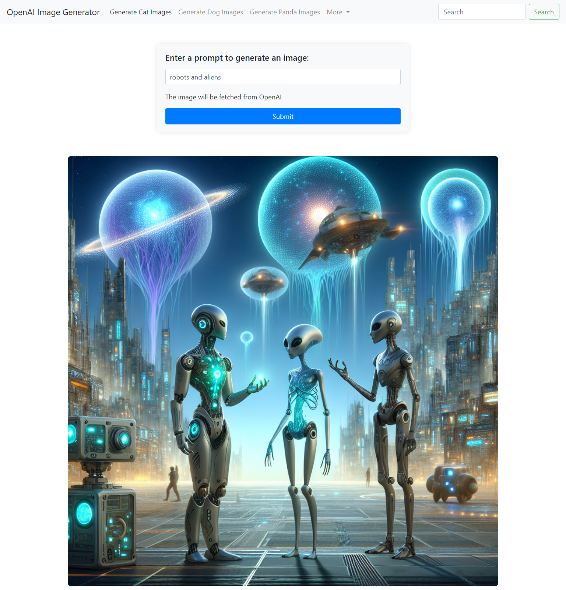
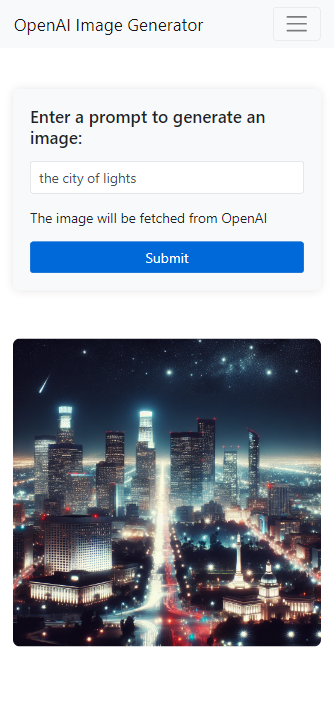

# DALL-E Image Generator

This project is a simple web-based application that generates images based on user prompts using the DALL-E API from OpenAI. The app takes a text prompt as input and returns an AI-generated image.

## Features

- Text-based prompt input for image generation.
- Integration with OpenAI's DALL-E API for generating images.
- Responsive design for desktop and mobile.
- Loader animation during image generation.
- Display of generated images in a centered layout.

## Technologies Used

- **Backend:** Python (Flask)
- **Frontend:** HTML, CSS, JavaScript
- **API Integration:** OpenAI API (DALL-E)
- **Styling:** Bootstrap for responsive layout

## How to Use

1. Clone this repository:
    ```bash
    git clone https://github.com/qunoot-ahmed/experience.git
    ```
3. Set your OpenAI API key in the environment:
    ```bash
    export OPENAI_API_KEY="your_openai_api_key"
    ```

4. Run the Flask server:
    ```bash
    python app.py
    ```

5. Open your browser and navigate to `http://127.0.0.1:5000`.

6. Enter a prompt and hit the "Submit" button to generate an image.

## Screenshots

### Desktop View:



### Mobile View:
