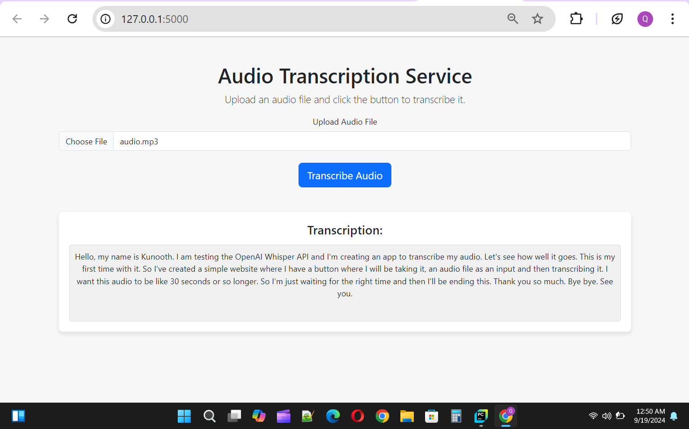

# Audio Transcription Project

## Overview

This project is a web application that allows users to upload audio files and receive transcriptions using OpenAI's Whisper API. The application is built with Flask and leverages the OpenAI Whisper model for transcription.



## Features

- Upload audio files in various formats.
- Transcribe audio files using OpenAI's Whisper API.
- Display transcription results on the web page.

## Requirements

- Python 3.12.6
- Flask
- OpenAI Whisper API
- ffmpeg

## Installation

### Clone the Repository

```bash
git clone https://github.com/qunoot-ahmed/experience/OpenAIWhisper.git